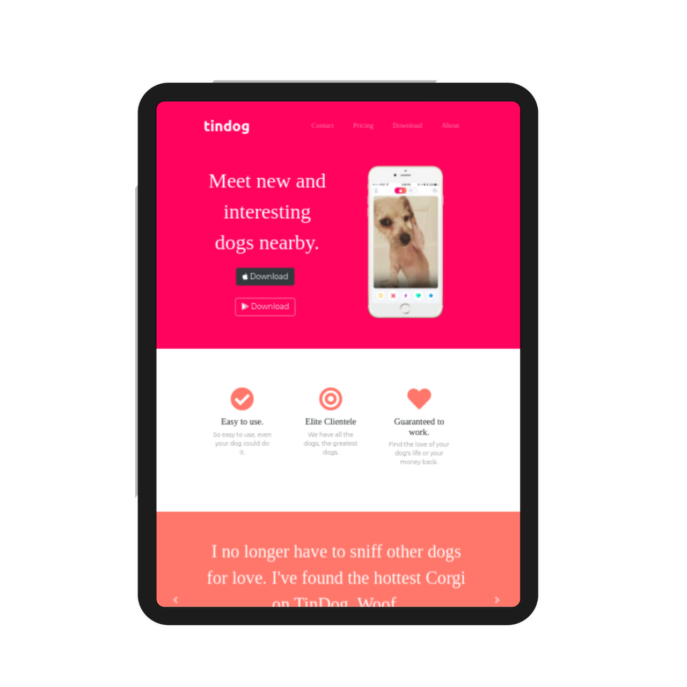

# tindog
**A cool site for show case your android or ios app for marketing**

 

# PROJECT SETUP IN LOCAL MACHIN

STEP 1: OPEN YOUR GIT BASH

STEP 2: CLONE THE REPOSATORY
> git clone  https://github.com/CodeWithSouma/TinDog-Website.git

STEP 3: OPEN YOUR VSCODE OR ANY OTHER IDE

STEP 4: DRAG THE FOLDER INTO VSCODE / OTHER IDE

STEP 5: COPPY INDEX.HTML FULL PATH AND OPEN ANY BROWSER AND PASTE THE PATH

---

## LICENCE
**[GNU V3.0](LICENSE)**

